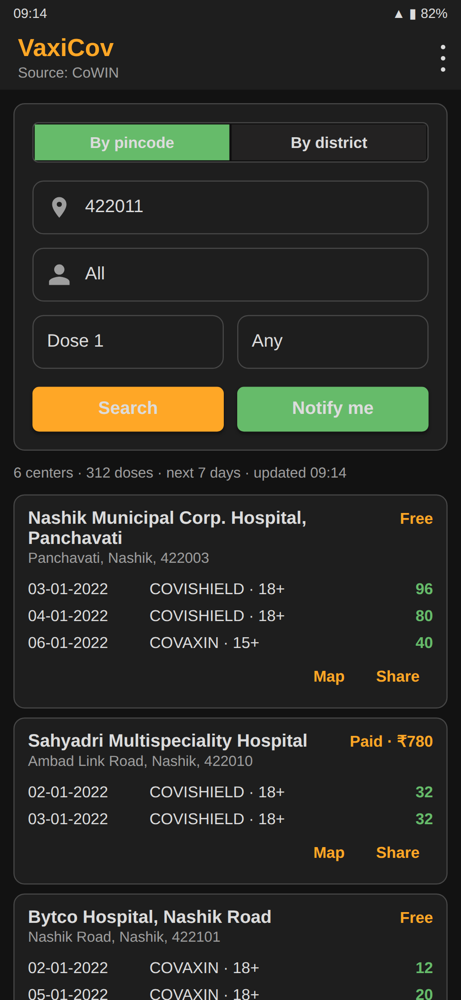
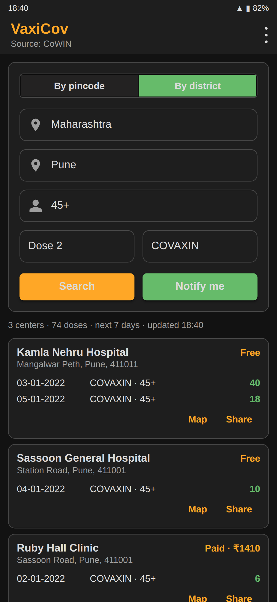
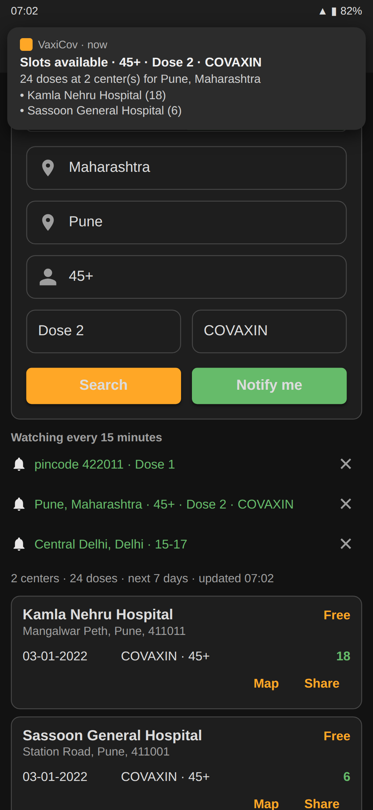
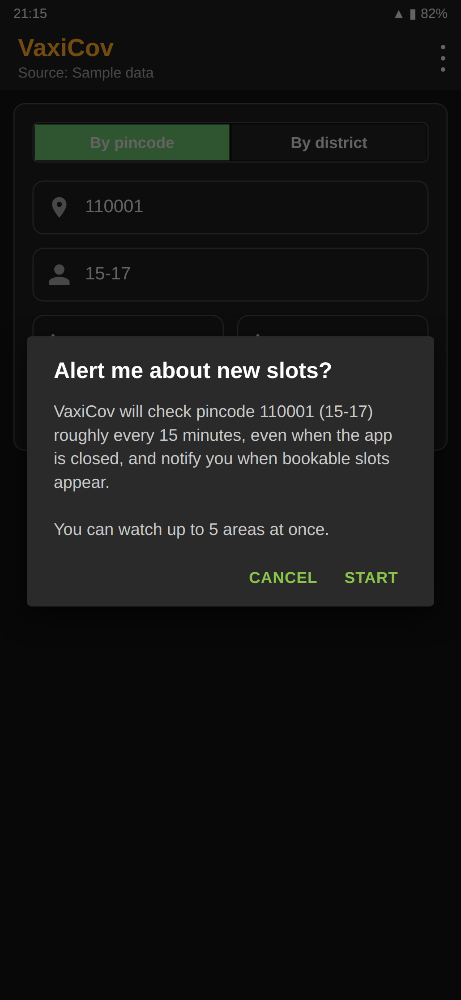

# VaxiCov – vaccination slot finder and notifier

VaxiCov is a small Android app that finds bookable vaccination slots by
pincode or district, filters them to the dose and vaccine you actually need,
and keeps watching in the background so you get a notification the moment
new slots open up. It was built in May 2021, at the height of India's second
COVID-19 wave, when slots on the CoWIN portal were gone within minutes of
being published.

**Download:** [Google Play](https://play.google.com/store/apps/details?id=com.vaxicov)

<p>
  
  
  
  
</p>

## Four things people use it for

**1. A first dose near home.** Type your pincode, pick *Dose 1*, tap
*Search*. You get every center within that pincode that has doses for the
next seven days, best-stocked first, with the vaccine and minimum age on
every line. Only sessions you can actually book are shown; fully booked
sessions are dropped rather than listed with a zero.

**2. A second dose that matches the first.** Second doses have to be the
same vaccine, and centers often hold Covishield only. Set *Dose 2* and
*COVAXIN* and the list, the dose counts and the alerts all describe Covaxin
second doses only. Nothing else gets in the way.

**3. Watching for the whole family.** Tap *Notify me* on any search to add
it to the watchlist: your pincode for yourself, your parents' district with
*45+*, your nephew's district with *15-17*. Up to five areas are checked
roughly every 15 minutes, even with the app closed or after a reboot. A
notification arrives only when the set of bookable sessions for that watch
changes, so you are not pinged every quarter hour about the same slots.
Tapping the notification opens the app with that search already run.

**4. Passing a slot on.** Every center card has *Share*, which puts a
plain-text summary (center, address, fee, dates, vaccines, doses) into
WhatsApp or any other app, and *Map*, which opens the address in your maps
app. That covers the "there are 40 doses at Bytco Hospital tomorrow" message
that used to be typed out by hand.

There is no sign-in and no tracking; the app needs the `INTERNET`
permission and nothing else.

## Built for the next one too

The registry an app like this talks to is different for every country and
every outbreak. VaxiCov therefore depends on one small interface,
[`SlotProvider`](app/src/main/java/com/vaxicov/data/SlotProvider.java),
and everything else (search, filters, the watchlist, the UI) is written
against it:

```java
public interface SlotProvider {
    String name();
    List<State> states() throws IOException;
    List<District> districts(int stateId) throws IOException;
    List<Center> centersByPin(int pincode, String date) throws IOException;
    List<Center> centersByDistrict(int districtId, String date) throws IOException;
}
```

Two implementations ship today:

| Provider | Source |
| --- | --- |
| `CowinSlotProvider` | India's public [CoWIN API](https://apisetu.gov.in/public/marketplace/api/cowin) via Retrofit |
| `SampleSlotProvider` | Fabricated but realistic data that changes hourly; no network |

*Use sample data* in the overflow menu switches to the second one. It makes
the whole app usable with no backend: for demos, for UI work, and as the
scaffold for wiring up a new registry before its API is final. To support a
different registry, implement `SlotProvider`, map its payload onto the
`Center`/`Session` models, and return it from
[`SlotProviders`](app/src/main/java/com/vaxicov/data/SlotProviders.java).
Nothing else needs to change. Filters that are specific to a campaign, such
as age groups and dose types, are enums in the domain package and are the
only other place to touch.

## Architecture

```
com.vaxicov
├── MainActivity            single screen: form, watchlist, results
├── AppPreferences          typed SharedPreferences (watchlist, last search, data source)
├── domain/                 pure Java, unit tested
│   ├── AgeGroup            15-17, 18-44, 45+, all
│   ├── DoseType            any / dose 1 / dose 2, per-dose capacity
│   ├── SearchQuery         immutable area + filters, describeArea/describeFilters
│   ├── SlotFilter          bookable-only filtering, ordering, change signature
│   └── DateFormats         dd-MM-yyyy handling pinned to Locale.US
├── data/
│   ├── SlotProvider        the extension point (see above)
│   ├── CowinSlotProvider   live registry
│   ├── SampleSlotProvider  offline data
│   ├── SlotProviders       picks the active provider
│   └── SlotRepository      background executor + main-thread callbacks
├── network/                Retrofit service, OkHttp client, bundled state list
├── notifier/
│   ├── SlotNotifierScheduler   watchlist + WorkManager scheduling
│   ├── SlotCheckWorker         checks every watch, notifies on change
│   └── AvailabilityNotifier    notification channel and content
├── adapters/CenterAdapter  center cards with Map and Share
└── pojo/                   Gson models for the CoWIN payloads
```

Design notes:

- The domain layer has no Android imports, which is what makes it testable
  with plain JUnit and reusable from both the Activity and the worker.
- Filtering returns copies. When a dose is selected, the copies carry that
  dose's capacity, so ordering, totals, the doses column and the change
  signature all describe what the user can book. Parsed data is never
  mutated.
- Background work uses WorkManager rather than `AlarmManager`. It respects
  Doze, survives reboots, and the 15-minute period is the platform minimum.
  One job checks the whole watchlist; each watch has its own notification.
- Dates sent to the API are formatted with `Locale.US` so devices set to a
  locale with non-Latin digits still produce `dd-MM-yyyy`.
- The registry base URL is a `BuildConfig` field read from
  `local.properties`, so a fork can point at a mirror or a staging endpoint
  without touching source.

## Building

Requirements: Android Studio 4.2 or newer (JDK 8 or 11), Android SDK 30.

```bash
git clone https://github.com/JayeshSuryavanshi/VaxiCov-COVID19-Vaccine-Center-Availability-Checker.git
cd VaxiCov-COVID19-Vaccine-Center-Availability-Checker
cp local.properties.example local.properties   # optional, see Configuration
./gradlew assembleDebug
./gradlew testDebugUnitTest
```

The debug APK lands in `app/build/outputs/apk/debug/`. Turn on
*Use sample data* from the overflow menu to try the app without network
access.

### Configuration

`local.properties` (git-ignored) can override:

| Key | Default | Purpose |
| --- | --- | --- |
| `vaxicov.cowinBaseUrl` | `https://cdn-api.co-vin.in/api/v2/` | Base URL of the CoWIN API |

### Tests

`app/src/test` covers the domain layer and the sample provider: age-group
and dose matching, pincode validation, filter combinations and ordering,
change signatures, query equality and descriptions, date formatting and
parsing, and the shape and determinism of sample data.

## Screens

The images above are rendered from the app's layouts with representative
data (Nashik and Pune centers, January 2022 dates) so each one shows a
complete use case. The original 1.0 captures from Google Play are kept in
[`Screenshots/v1.0`](Screenshots/v1.0).

## Contributors

VaxiCov is a two-person project built for family, friends and neighbours
who were refreshing CoWIN by hand in May 2021.

| | |
| --- | --- |
| **Jayesh Suryavanshi** | 1.1 rebuild (Dec 2021 – Jan 2022): single-screen redesign, `SlotProvider` abstraction with the CoWIN and sample-data sources, dose/vaccine filters, watchlist and WorkManager alerts, share and map actions, unit-tested domain layer, build modernisation, this README. Play Store release management. |
| **Akshay Chavan** | Original 1.0 app (May 2021): CoWIN integration, first search screen and notifier, Google sign-in and e-mail alerts, Play Store listing. |

The Play Store `applicationId` keeps its original value so existing installs
continue to update; the source code lives under the neutral `com.vaxicov`
namespace.
